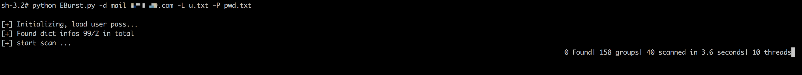
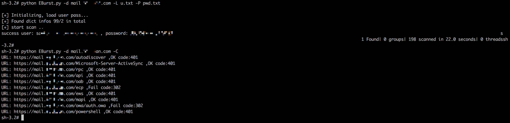

# EBurst 0.1

这个脚本主要提供对Exchange邮件服务器的账户爆破功能，集成了现有主流接口的爆破方式。
搜了一圈互联网上的工具，未发现太优秀的工具，也和本身的需求不是太贴切，故抽时间写了个半自动化的脚本。

## 作者 ##

咚咚呛 

如有其他建议，可联系微信280495355

## 技术细节 ##
技术细节如下

	1、支持多线程爆破
	2、支持字典爆破
	3、支持爆破漏洞验证功能
	4、支持接口认证方式识别并自动切换功能
	5、支持爆破的接口如下：
	    https://Exchangeserver/ecp
            https://Exchangeserver/ews
            https://Exchangeserver/oab
            https://Exchangeserver/owa
            https://Exchangeserver/rpc
            https://Exchangeserver/api
            https://Exchangeserver/mapi
            https://Exchangeserver/powershell
	    	https://Exchangeserver/autodiscover
	    	https://Exchangeserver/Microsoft-Server-ActiveSync
	    
    

## 使用 ##
技术细节如下

程序下载

> root# <kbd>git clone https://github.com/grayddq/EBurst.git</kbd>
>
> root# <kbd>cd EBurst</kbd>
>
> root# <kbd>sudo pip install -r requirements.txt</kbd>

参数参考
     
>      [root@grayddq  EBurst]# ls
>      EBurst.py  lib  pic  README.md  requirements.txt
>      
>      [root@grayddq  EBurst]# python EBurst.py 
>      Usage: EBurst.py [options]
>      
>      Options:
>        -h, --help            show this help message and exit
>        -d DOMAIN             邮箱地址
>        -L USERFILE           用户文件
>        -P PASSFILE           密码文件
>        -l USER               指定用户名
>        -p PASSWORD           指定密码
>        -T THREAD, --t=THREAD
>                              线程数量，默认为100
>        -C, --c               验证各接口是否存在爆破的可能性
>        --protocol            通讯协议默认https，可无需指定，demo: --protocol http
>      
>        type:
>          EBurst 扫描所用的接口
>      
>          --autodiscover      autodiscover接口，默认NTLM认证方式，自Exchange Server 2007开始推出的一项
>                              自动服务，用于自动配置用户在Outlook中邮箱的相关设置，简化用户登陆使用邮箱的流程。
>          --ews               ews接口，默认NTLM认证方式，Exchange Web
>                              Service,实现客户端与服务端之间基于HTTP的SOAP交互
>          --mapi              mapi接口，默认NTLM认证方式，Outlook连接Exchange的默认方式，在2013和2013之后开
>                              始使用，2010 sp2同样支持
>          --activesync        activesync接口，默认Basic认证方式，用于移动应用程序访问电子邮件
>          --oab               oab接口，默认NTLM认证方式，用于为Outlook客户端提供地址簿的副本，减轻Exchange的负担
>          --rpc               rpc接口，默认NTLM认证方式，早期的Outlook还使用称为Outlook Anywhere的RPC交互
>          --api               api接口，默认NTLM认证方式
>          --owa               owa接口，默认http认证方式，Exchange owa
>                              接口，用于通过web应用程序访问邮件、日历、任务和联系人等
>          --powershell        powershell接口（暂不支持），默认Kerberos认证方式，用于服务器管理的Exchange管理控制
>                              台
>          --ecp               ecp接口，默认http认证方式，Exchange管理中心，管理员用于管理组织中的Exchange的Web控
>                              制台
>      
>      [root@grayddq  EBurst]# python EBurst.py -L users.txt -p 123456abc -d mail.xxx.com
>      
>      [root@grayddq  EBurst]# python EBurst.py -L users.txt -p 123456abc -d mail.xxx.com --ews

## 程序运行截图 ##

备注：其中多线程框架代码参考了lijiejie开源的代码，在此感谢。
