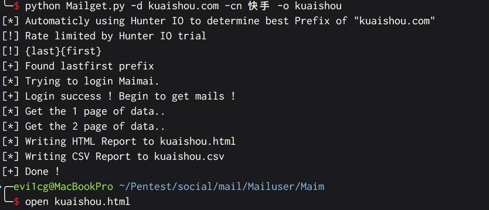

# Usage

```
usage: Mailget.py [-h] [-d DOMAIN] [-cn COMNAME] [-o OUTPUT] [-pr PREFIX]

Discovery Maimai

optional arguments:
  -h, --help            show this help message and exit
  -d DOMAIN, --domain DOMAIN
                        The domain want to search
  -cn COMNAME, --comname COMNAME
                        The company name（example:饿了么）
  -o OUTPUT, --output OUTPUT
                        Output file (do not include extentions)
  -pr PREFIX, --prefix PREFIX
                        Select a prefix for e-mail generation (auto,full,first
                        last,firstmlast,flast,first.last,fmlast,lastfirst)
```

注册一个脉脉账号，注册一个Hunter.io账号，在Mailget中填入相关信息。

# Example



输出csv及html格式文件


# Reference

1.https://github.com/vysec/LinkedInt

2.https://vincentyiu.co.uk/maiint-profiling-china-based-employees/