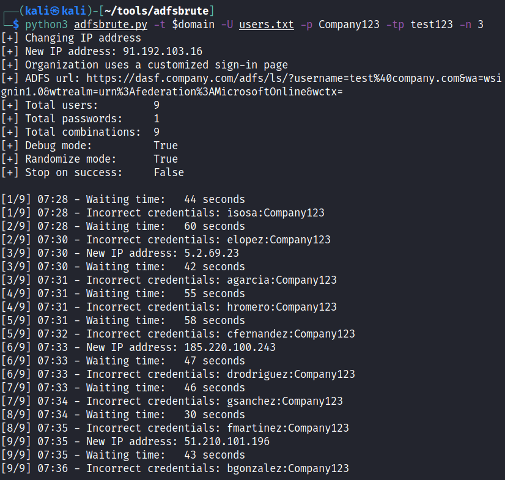
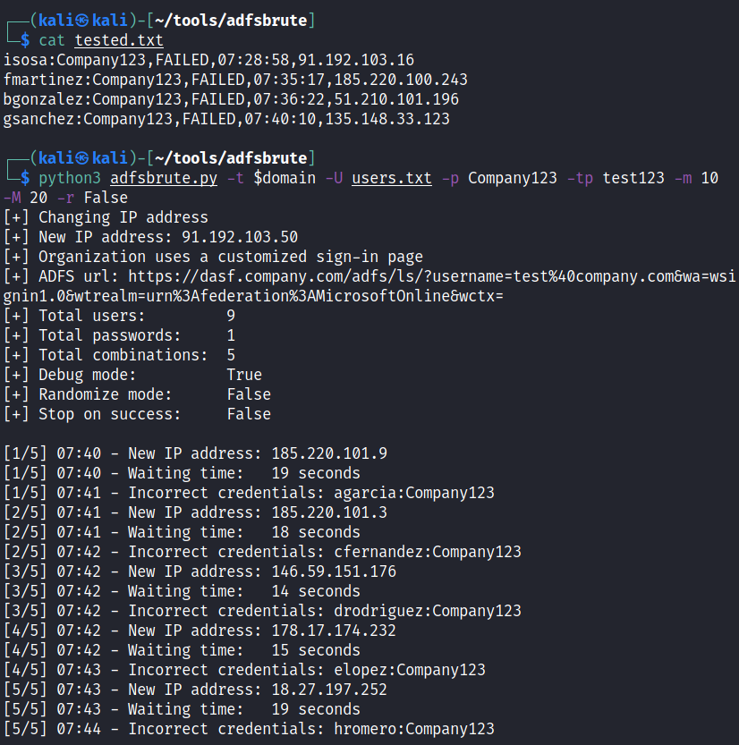
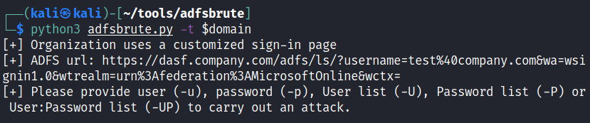

# adfsbrute

A script to test credentials against Active Directory Federation Services (ADFS), calculating the ADFS url of an organization and allowing password spraying or bruteforce attacks. 

The main idea is carrying out password spraying attacks with a random and high delay between each test and using a list of proxies or [Tor](https://github.com/ricardojoserf/adfsbrute#using-tor) to make the detection by the Blue Team more difficult. Brute force attacks are also possible, or testing credentials with the format *username:password* (for example from [Pwndb](https://github.com/davidtavarez/pwndb)). Tested logins will get stored in a log file to avoid testing them twice.

## Usage

```
./adfsbrute.py -t TARGET [-u USER] [-U USER_LIST] [-p PASSWORD] [-P PASSWORD_LIST] [-UL userpassword_list]
[-m MIN_TIME] [-M MAX_TIME] [-tp TOR_PASSWORD] [-pl PROXY_LIST] [-n NUMBER_OF_REQUESTS_PER_IP]
[-s STOP_ON_SUCCESS] [-r RANDOM_COMBINATIONS] [-d DEBUG] [-l LOG_FILE]
```

The parameters for the attacks are:

	* -t: Target domain. Example: test.com
	
	* -u: Single username. Example: agarcia@domain.com
	
	* -U: File with a list of usernames. Example: users.txt
	
	* -p: Single password: Example: Company123
	
	* -P: File with a list of passwords. Example: passwords.txt

	* -UP: File with a list of credentials in the format "username:password". Example: userpass.txt

	* -m : Minimum value of random seconds to wait between each test. Default: 30

	* -M : Maximum value of random seconds to wait between each test. Default: 60

	* -tp: Tor password (change IP addresses using Tor)

	* -pl: Use a proxy list (change IP addresses using a list of proxy IPs)

	* -n: Number of requests before changing IP address (used with -tp or -pl). Default: 1

	* -s: Stop on success, when one correct credential is found. Default: False

	* -r: Randomize the combination of users and passwords. Default: True

	* -d: Show debug messages. Default: True

	* -l: Log file location with already tested credentials. Default: tested.txt


## Examples

Password spraying with password "Company123", tor password is "test123" and changing the IP every 3 requests:

```
python3 adfsbrute.py -t company.com -U users.txt -p Company123 -tp test123 -n 3
```




Password spraying with password "Company123", tor password is "test123", changing the IP for every request, random delay time between 10 and 20 seconds and do not randomize the order of users:

```
python3 adfsbrute.py -t company.com -U users.txt -p Company123 -tp test123 -m 10 -M 20 -r False
```




Finding ADFS url:

```
python3 adfsbrute.py -t company.com
```





## Using Tor

To use Tor to change the IP for every request, you must hash a password:

```
tor --hash-password test123
```

In the file /etc/tor/torrc, uncomment the variable *ControlPort* and the variable *HashedControlPassword*, and in this last one add the hash:

```
ControlPort 9051
HashedControlPassword 16:7F314CAB402A81F860B3EE449B743AEC0DED9F27FA41831737E2F08F87
```

Restart the tor service and use this password as argument for the script ("-tp test123" or "--tor_password 123")

```
service tor restart
```

## Note

This script is implemented to test in security audits, DO NOT use without proper authorization from the company owning the ADFS or you will block accounts.
